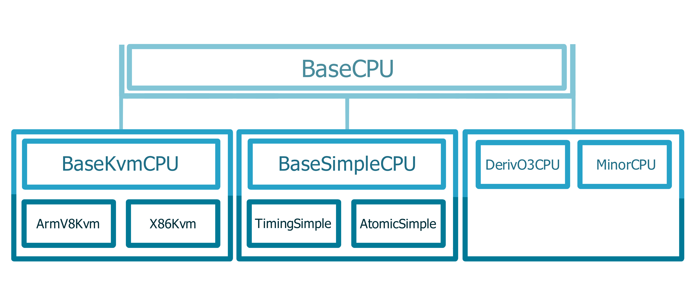

<!-- _class: title -->

## Modeling CPU cores in gem5

---

## Outline

- CPU models in gem5​
  - AtomicSimpleCPU, TimingSimpleCPU, O3CPU, MinorCPU, KvmCPU​

- Using the CPU models​
  - Set-up a simple system with two cache sizes and three CPU models​

- Look at the gem5 generated statistics​
  - To understand differences among CPU models

---

## Summary of gem5 CPU Models

---

## Outline

- **CPU models in gem5​**
  - AtomicSimpleCPU, TimingSimpleCPU, O3CPU, MinorCPU, KvmCPU​

- Using the CPU models​
  - Set-up a simple system with two cache sizes and three CPU models​

- Look at the gem5 generated statistics​
  - To understand differences among CPU models

---

SimpleCPU

Functional, In-Order CPU Models

---

<!--> Make this a class? <-->
<!-- 

## SimpleCPU

### **Atomic**

Seq. of nested calls
Use: Warming up, FF
<!--   -->

### **Functional**

Backdoor access to mem.
(loading binaries)
No effect on coherency states
<!--   -->

### **Timing**

Split transactions
Models queuing delay and
resource contention

---

<!-- 

## Summary of gem5 CPU Models

 

### **BaseKvmCPU**

- Very fast
- No timing
- No caches, BP
 

### **BaseSimpleCPU**

- Fast
- Some timing
- Caches, limited BP
 

### **DerivO3CPU and MinorCPU**

- Slow
- Timing
- Caches, BP

<!--  --> -->

---

## Interaction of CPU model with other parts of gem5

---

## Outline

- CPU models in gem5​
  - AtomicSimpleCPU, TimingSimpleCPU, O3CPU, MinorCPU, KvmCPU​

- **Using the CPU models​**
  - Set-up a simple system with two cache sizes and three CPU models​

- Look at the gem5 generated statistics​
  - To understand differences among CPU models

---

Let's use these CPU Models!

---

## Material to use

gem5-bootcamp-env/materials/using-gem5/05-cpu-models/
&nbsp;&nbsp;&nbsp;&nbsp;&nbsp;&nbsp;cpu-models.py
&nbsp;&nbsp;&nbsp;&nbsp;&nbsp;&nbsp;IntMM/
&nbsp;&nbsp;&nbsp;&nbsp;&nbsp;&nbsp;finished-material/

---
